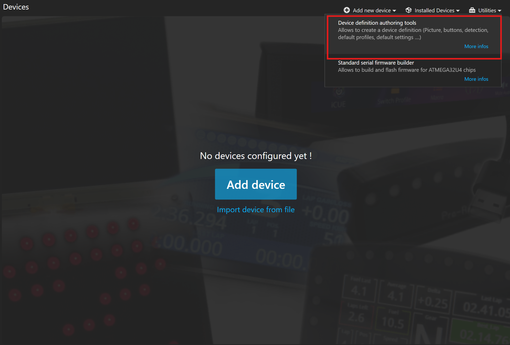

# LED control

There are a few things to set up to allow SimHub to make contact with your controller.&#x20;

First you'll need to[ set up a VID/PID](../3.-coding/naming-the-controller.md) for the controller.

When you've [uploaded](../3.-coding/upload.md) the firmware to your controller, you can connect to SimHub:

*   Go to devices, utilities in top right corner and select "Device definition authoring tools"

    <figure><figcaption></figcaption></figure>

* Select new device definition and name the device

<figure><figcaption></figcaption></figure>

* Follow instructions for setting up the device page with branding and image

<figure><figcaption></figcaption></figure>

* Scroll down to add LEDs and a VoCore screen if needed

<figure><figcaption></figcaption></figure>

* You can also define which LEDs do what by sorting your LEDs in the section below

<figure><figcaption></figcaption></figure>

* Set the LED count and edit the physical LED mapping if wanted

<figure><figcaption></figcaption></figure>

* Set communication to Standard SimHub Serial protocol and enter your VID/PID

<figure><figcaption></figcaption></figure>

* Save definition!

<figure><figcaption></figcaption></figure>

* Now you can add a new device

<figure><figcaption></figcaption></figure>

* Find the definition you made and add it!

<figure><figcaption></figcaption></figure>
